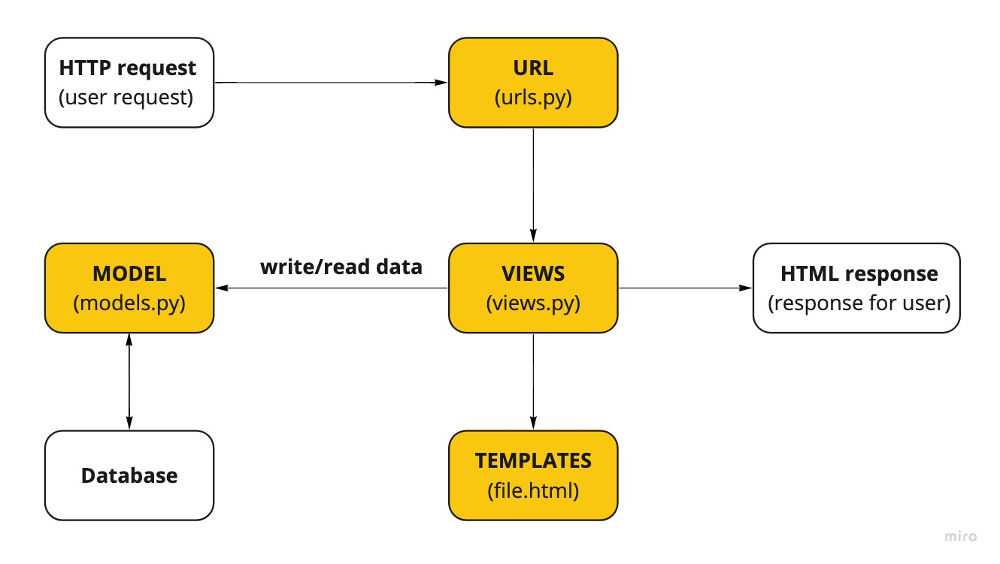

# Pengenalan Aplikasi Django dan Models View Template (MVT) pada Django

Tugas 2 Pemrograman Berbasis Platform (CSGE602022) - diselenggarakan oleh Fakultas Ilmu Komputer Universitas Indonesia, Semester Ganjil 2022/2023

Nama : Fitria Dwi Cahya

NPM : 2106751410

Kelas : PBP - D

## HerokuApp Link

[https://new-catalog-app.herokuapp.com/katalog/](https://new-catalog-app.herokuapp.com/katalog/)

## Bagan request client ke web aplikasi dan responnya

Django merupakan framework web development berbasis Python dengan mengikuti pola arsitektur Model–Template–Views (MVT). Ketika user melakukan request, user akan mengirim request dengan mengakses URL. URL akan ditangkap oleh (Urls.py) dan akan dilakukan screening url di URLConf untuk memeriksa ketersediaan request tersebut pada fungsi yang sesuai di Views(views.py). Jika request tersedia, maka request akan diproses. Url(url.py) akan menghubungkan url pada browser ke Views(views.py). Dalam request tersebut, user dapat memerlukan data yang berasal dari database. Jika demikian, maka Views (views.py) akan mencari data tersebut pada Models(models.py). Models berfungsi sebagai representasi dari database yang mengembalikan data yang dibutuhkan user. Sementara itu, Views berfungsi sebagai penghubung Models dengan Template karena data dari Models akan dikirimkan ke Template (file.html). Views akan mencarikan file HTML yang sesuai dengan request user di folder templates. Templates (html) akan menampilkan request user untuk dilihat pada tampilan di browser. Views juga akan mengirimkan HTML response ke user.

## Penggunaan Virtual Environment

Virtual Environment adalah sebuah ruang lingkup virtual yang terisolasi dari dependencies utama dan berfungsi untuk menyimpan semua package dan dependences yang dibutuhkan dalam suatu project. Virtual Environment sangat berguna ketika kita membutuhkan dependencies yang berbeda-beda antara project satu dengan lainnya yang berjalan pada satu system operasi yang sama. Virtual Environment biasa digunakan untuk project berbasis Python.

Project Django berbasis python yang dibuat tanpa menggunakan environment masih dapat dilakukan, namun sangat beresiko karena pengaksesan project tersebut hanya dapat dilakukan melalui sistem operasi dengan device berisi package dan dependences milik pengembang (lokal) sedangkan device lainnya yang memiliki dependeces berbeda nantinya tidak dapat mengakses project tersebut dan harus menginstall kembali package dan dependences yang diperlukan sehingga akan merepotkan. Disinilah pentingnya virtual environment untuk menjaga konsistensi package dan dependences dari suatu project.

## Implementasi konsep Model-View-Template

1. Membuat fungsi pada views.py yang dapat melakukan pengambilan data dari model dan dikembalikan ke dalam sebuah HTML.
   > Pada view.py, dibuat sebuah fungsi yang akan mengambil data Models yang berasal dari database dengan menggunakan perintah CatalogItem.objects.all(). Fungsi kemudian akan merender data dengan perintah render() ke halaman Template html (file.html) yang akan dituju. Halaman nantinya akan menampilkan data-data dalam bentuk response dari views kepada user di suatu browser.
2. Membuat sebuah routing untuk memetakan fungsi yang telah kamu buat pada views.py.
   > Terlebih dahulu membuat url (pada folder django project, urls.py) yang akan dijadikan sebagai routing pada saat user ingin mengunjungi halaman project ini. Pada file urls.py yang ada di django app (katalog), import path yang berada di package django.urls dan dan ditambahkan path yang mengarah ke function yang sesuai di dalam di Views(view.py).
3. Memetakan data yang didapatkan ke dalam HTML dengan sintaks dari Django untuk pemetaan data template.

   > Data json diload terlebih dahulu menggunakan perintah python manage.py loaddata initial_catalog_data.json. Data ini direpresentasikan dalam Models dan akan disimpan dalam context di function yang ada pada views.py Data selanjutnya dikirimkan ke template html menggunakan render().

4. Melakukan deployment ke Heroku terhadap aplikasi agar dapat diakses oleh teman-temanmu melalui Internet.
   > Buat sebuah repositori baru di GitHub yang akan menjadi repositori aplikasi Django. Selanjutnya, lakukan git init pada direktori django yang telah dibuat dan atur origin dari repositori git lokal ke repositori GitHub yang telah dibuat. Buat file bernama Procfile, dpl.yml, dan .gitignore yang akan mengatur deployment di Heroku. Kemudian, lakukan git Add, commit, dan push semua perubahan yang telah dilakukan ke GitHub repositori aplikasi ini. Tambahkan variabel repository secret baru untuk melakukan deployment, yaitu HEROKU_APP_NAME dan HEROKU_API_KEY. Aplikasi Django siap untuk di-deploy ke Heroku.
