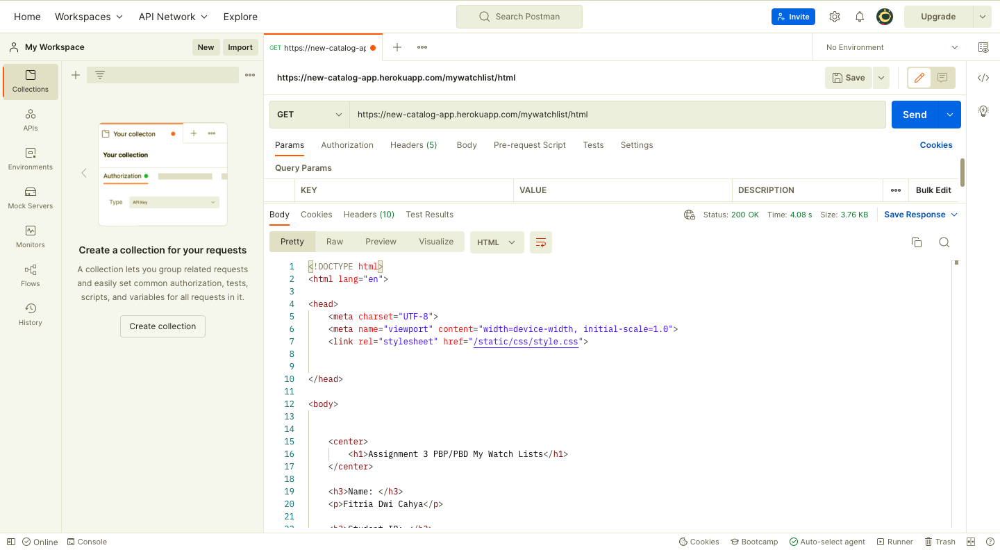
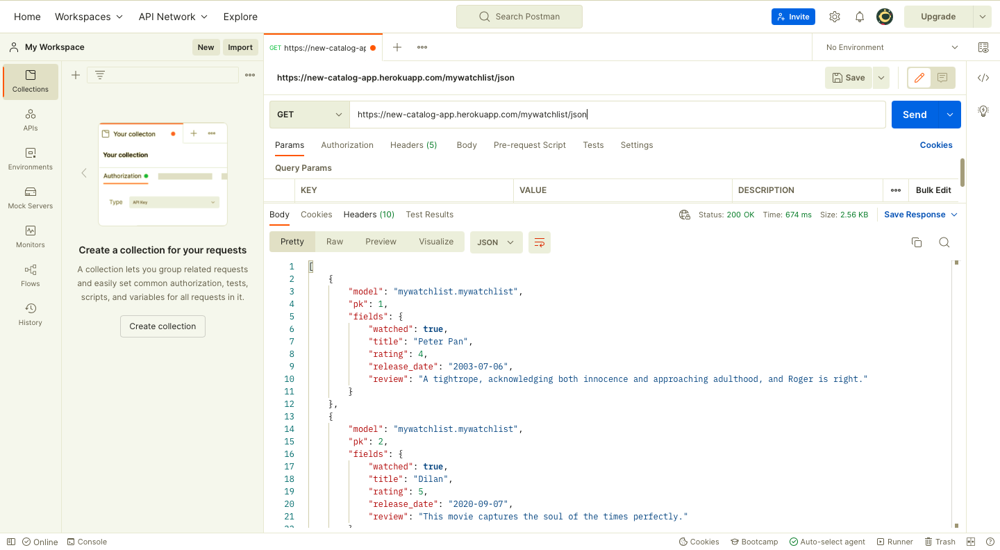
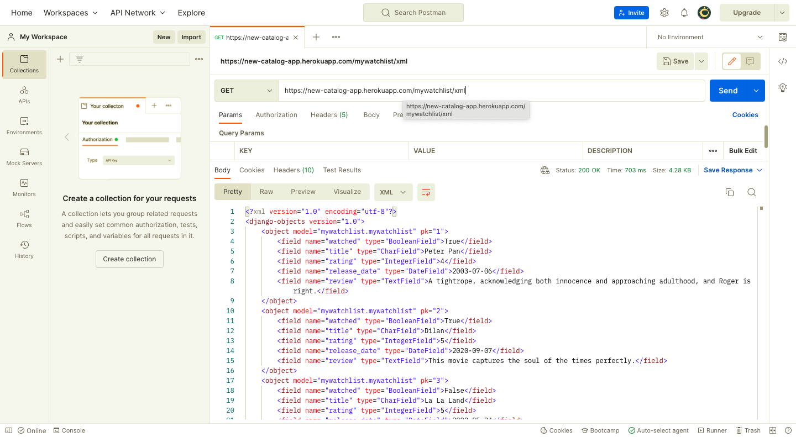

# Pengimplementasian Data Delivery Menggunakan Django

Tugas 3 Pemrograman Berbasis Platform (CSGE602022) - diselenggarakan oleh Fakultas Ilmu Komputer Universitas Indonesia, Semester Ganjil 2022/2023

## Creator

> Nama : Fitria Dwi Cahya
> NPM : 2106751410
> Kelas : PBP - D

## Link Deployment:

[HTML page 🚀](https://new-catalog-app.herokuapp.com/mywatchlist/html) |
[XML page 🚀](https://new-catalog-app.herokuapp.com/mywatchlist/xml) |
[JSON page 🚀](https://new-catalog-app.herokuapp.com/mywatchlist/json)

## Perbedaan JSON, XML, dan HTML

**JSON (JavaScript Object Notation)** adalah sebuah format data berbasis teks yang digunakan untuk pertukaran data baik antar website dan pertukaran data antar platform dengan JSON API. JSON menyimpan data dalam format map dengan pasangan key (berupa String) dan value (data primitif JavaScript).

Sementara itu, **XML(Extensible Markup Language)** adalah sebuah format untuk membantu proses penyimpanan dan pentransferan data. Mirip dengan HTML, XML juga menggunakan tag untuk mengenali value dari data, namun developer dapat membuat tagnya sendiri sesuai keinginannya, tidak seperti HTML yang sudah baku.

Kemudian, **HTML (HyperText Markup Language)** adalah sebuah format yang digunakan sebagai pondasi untuk membuat website. HTML biasanya digunakan bersama CSS (Cascading Style Sheet) yang berperan dalam memperindah tampilan web, dan Javascript yang berperan untuk membuat UI menjadi dinamis dan memproses logika data. HTML bersifat statis dan hanya digunakan untuk menampilkan data, sedangkan JSON dan XML dapat menyimpan dan mengirim data antar sistem, platform, atau website.

**Perbedaan utama XML dan JSON**

1. Bahasa yang digunakan dalam Xml berupa tag yang didefinisikan secara manual,JSON berupa syntax dalam bentuk Objek JavaScript
2. Data XML disimpan sebagai tree structure, sedangkan JSON akan melakukan pemrosesan dan pemformatan dokumen dan objek
3. Data XML berukuran besar,lambat saat parsing, dan tag tidak readable , sedangkan JSON berukuran besar,cepat saat parsing, dan readable.
4. XML mendukung tipe data bagan, charts, dan data non-primitif lain, dan Namespaces, sedangkan JSON hanya mendukung string, angka, boolean, objek, dan array dengan tidak mendukung data non-primitif dan Namespaces.
5. XML dapat digunakan oleh UTF-8 dan UTF-16, sedangkan JSON digunakan oleh UTF dan ASCII

## Pentingnya data delivery dalam pengimplementasian sebuah platform

Secara umum, platform seperti website atau aplikasi tersusun atas bagian frontend (tampilan untuk user) dan backend (logika aplikasi termasuk data). Frontend dan backend tidak dapat berinteraksi secara langsung untuk pertukaran data, diantara keduanya dibutuhkan perantara untuk menampilkan responses dari request yang diminta oleh user, disinilah peran data delivery seperti JSON dan XML. Data delivery akan membantu platform dalam pengolahan data diantara frontend dan backend dan juga mempermudah penyajian informasi dan seluruh komponen dari website sesuai formatting yang diminta oleh user, misal browser request HTML page, maka server juga harus mengembalikan HTML page, berlaku untuk XML, JSON, dan sebagainya.

## Screenshots dari Postman

### Test HTML URLs



### Test JSON URLs



### Test XML URLs



## Pengimplementasian Data Delivery

## Konfigurasi Django App Baru "mywatchlist"

1. Membuka direktori project, dalam contoh ini ialah direktori django-project
2. Aktifkan virtual environment dengan menjalankan perintah berikut.
   ```shell
   Windows:
   env\Scripts\activate.bat
   Unix (Linux & Mac OS):
   source env/bin/activate
   ```
3. Membuat sebuah django-app dengan nama "mywatchlist" dengan perintah berikut `python manage.py startapp mywatchlist`
4. Tambahkan aplikasi "mywatchlist" pada variabel INSTALLED_APPS di settings.py folder django-project untuk mendaftarkan aplikasi mywatchlist agar dapat di baca oleh django.

   ```shell
   INSTALLED_APPS = [
   'events.apps.EventsConfig',
   'Django.contrib.admin',
   # tambahkan aplikasi disini
   'mywatchlist,'
   ]
   ```

   <br></br>

   ```

   ```

## Membuat model "Watchlist" dan file "mywatchlist_data.JSON"

1. Memmbuat model watchlist di direktori `mywatchlist` dengan atribuat berikut.

   - watched : BooleanField
   - title : CharField, dengan maksimal character = 280
   - rating : IntegerField
   - release_date : CharField
   - review : TextField

     Maka, models.py di mywatchlist menjadi seperti ini

   ```python
   from django.db import models
   from django.core.validators import MaxValueValidator, MinValueValidator
   # Create your models here.
   class WatchList(models.Model):
      watched = models.BooleanField()
      title = models.CharField(max_length=280)
      rating = models.IntegerField(validators=[MinValueValidator(1), MaxValueValidator(5)])
      release_date = models.CharField()
      review =  models.TextField()
   ```

2. Melakukan migrasi data dari models kita agar attribute model kita tersimpan di django database dengan perintah berikut.
   ```shell
   python manage.py makemigrations
   python manage.py migrate
   ```
3. Membuat sebuah data sesuai dengan atribut pada model WatchList dan akan disimpan ke database django local. Buat folder `fixtures` di folder `mywatchlist`.
4. Membuat file `mywatchlist_data.json` di folder `fixtures` tersebut. Isi file dengan 10 data sebagai berikut.
   ```json
   [
     {
       "model": "mywatchlist.mywatchlist",
       "pk": 1,
       "fields": {
         "watched": true,
         "title": "Peter Pan",
         "rating": 4,
         "release_date": "2003-07-06",
         "review": "A tightrope, acknowledging both innocence and approaching adulthood, and Roger is right."
       }
     },
     {
       "model": "mywatchlist.mywatchlist",
       "pk": 2,
       "fields": {
         "watched": true,
         "title": "Dilan",
         "rating": 5,
         "release_date": "2020-09-07",
         "review": "This movie captures the soul of the times perfectly."
       }
     },
     {
       "model": "mywatchlist.mywatchlist",
       "pk": 3,
       "fields": {
         "watched": false,
         "title": "La La Land",
         "rating": 5,
         "release_date": "2022-05-24",
         "review": "It had some peppy musical moments, vivid scenes, colorful costumes and had a warm spirit about it. "
       }
     },
     {
       "model": "mywatchlist.mywatchlist",
       "pk": 4,
       "fields": {
         "watched": true,
         "title": "Tenggelamnya Kapal Van Der Wick",
         "rating": 5,
         "release_date": "2012-08-24",
         "review": "There are no reviews yet. Be the first one to write a review."
       }
     },
     {
       "model": "mywatchlist.mywatchlist",
       "pk": 5,
       "fields": {
         "watched": false,
         "title": "Munafik 5",
         "rating": 3,
         "release_date": "2022-07-15",
         "review": "A haunted house, an exorcist and a trip to a haunted location."
       }
     },
     {
       "model": "mywatchlist.mywatchlist",
       "pk": 6,
       "fields": {
         "watched": false,
         "title": "Lady Bird",
         "rating": 2,
         "release_date": "2022-08-25",
         "review": "Artistically inclined, with an explosive mix of sensitivity, alienation and martyred self-importance."
       }
     },
     {
       "model": "mywatchlist.mywatchlist",
       "pk": 7,
       "fields": {
         "watched": true,
         "title": "5 cm",
         "rating": 5,
         "release_date": "2022-06-01",
         "review": "Some adventure aspects about 5 best friends who go on a mountain climbing."
       }
     },
     {
       "model": "mywatchlist.mywatchlist",
       "pk": 8,
       "fields": {
         "watched": false,
         "title": "Paranormal Activity: Next of Kin",
         "rating": 2,
         "release_date": "2018-06-29",
         "review": "Tired sequel in gory found-footage horror series."
       }
     },
     {
       "model": "mywatchlist.mywatchlist",
       "pk": 9,
       "fields": {
         "watched": true,
         "title": "Thor: Love and Thunder",
         "rating": 3,
         "release_date": "2020-07-27",
         "review": "The plot is funny and the scenes with the human Thor."
       }
     },
     {
       "model": "mywatchlist.mywatchlist",
       "pk": 10,
       "fields": {
         "watched": false,
         "title": "Guardiance of galaxy.",
         "rating": 4,
         "release_date": "2022-07-24",
         "review": "A fun, no-frills single-player campaign full of cosmic comic book flavor.."
       }
     }
   ]
   ```
5. Menyimpan data dalam database loka dengan jalankan perintah `python manage.py loaddata mywatchlist_data.json`. Konfigurasi database atau models dari proyek django selesai.

<br></br>

## Konfigurasi Views yang memetakan data dari models ke template HTML

1.  Mmembuka file ` views.py`` di folder  `mywatchlist```.
2.  Mengingmport modul yang dibutuhkan

```python
   # Tambahkan pada baris pertama views.py
   from django.shortcuts import render
   from django.http import HttpResponse
   from django.core import serializers
   from mywatchlist.models import WatchList
```

3. Membuat fungsi `show_mywatchlist` untuk menampilkan data. Fungsi akan berisi hal berikut:

   ```python
   def show_mywatchlist(request):
    mywatchlist_data = MyWatchList.objects.all()
    countWatched = 0
    countNotWatched = 0

    # Fitur untuk menampilkan pesan
    message = ""

    # Menghitung jumlah film yang telah ditonton
    for alreadyWatched in mywatchlist_data:
        if (alreadyWatched.watched == True):
            countWatched += 1
        else:
            countNotWatched += 1

    if (countWatched >= countNotWatched):
        message = "Selamat, kamu sudah banyak menonton!"
    else:
        message = "Wah, kamu masih sedikit menonton!"

    context = {
        'data_mywatchlist': mywatchlist_data,
        'name': 'Fitria Dwi Cahya',
        'studentId': "2106751410",
        'message': message,
    }
    return render(request, "mywatchlist.html", context)

   ```

4. Membuat fungsi yang akan mengembalikan file JSON dari database dan file XML dari database.

   ````python
   def show_json(request):
     data = WatchList.objects.all()
     return HttpResponse(serializers.serialize("json", data), content_type="application/json")
   def show_xml(request):
      data = WatchList.objects.all()
      return HttpResponse(serializers.serialize("xml", data), content_type="application/xml")
   def show_json_by_id(request, id):
     data = WatchList.objects.filter(pk=id)
     return HttpResponse(serializers.serialize("json", data), content_type="application/json")
   def show_xml_by_id(request, id):
      data = WatchList.objects.filter(pk=id)
      return HttpResponse(serializers.serialize("xml", data), content_type="application/xml")
   ```
   ````

## Membuat sebuah file HTML mywatchlist.html pada templates

1. Membuat folder ` template` di dalam direktori mywatchlist dan membuat file mywatchlist.html. Kemudian salin dan tempel code ke dalam file.

   ```html
   
   ```



 <center><h1>Assignment 3 PBP/PBD My Watch Lists</h1></center>

  <h3>Name: </h3>
  <p>{{name}}</p>

  <h3>Student ID: </h3>
  <p>{{studentId}}</p>
  <h3>Status: </h3>
  <p>{{ message }}</p>
  <center><h2>My Watch List: </h2> </center>

  <center><table border="1" cellspacing="2" cellpadding="8" align="left">
    <tr>
      <th>Watched</th>
      <th>Title</th>
      <th>Rating</th>
      <th>Release_date</th>
      <th>Review</th>
    </tr>
    
    <tr>
      <td align="left">{{mywatchlist.watched}}</td>
      <td align="left"> {{mywatchlist.title}}</td>
      <td align="center">{{mywatchlist.rating}}</td>
      <td align="center">{{mywatchlist.release_date}}</td>
      <td align="left"> {{mywatchlist.review}}</td>
    </tr>
    
  </table>
  <center>
  

    ````

## Membuat routing untuk memetakan fungsi yang telah dibuat pada views.py.

1. Membuat ` urls.py` di direktori ` mywatchlist` untuk melakukan routing terhadap fungsi views yang telah dibuat sehingga nantinya halaman HTML dapat ditampilkan lewat browser.
2. Melakukan import fungsi views dengan menambahkan kode berikut pada baris kedua urls.py
   ```python
   from mywatchlist.views import show_mywatchlist_, show_json, show_json_by_id, show_xml, show_xml_by_id
   ```
3. Menambahkan path baru sesuai fungsi views masing-masing. Tambahkan kode berikut pada urls.py.
   ```python
   urlpatterns = [
     path('', show_my_watch_list, name='show_mywatchlist'),
     path('xml/', show_xml, name='show_xml'),
     path('json/', show_json, name='show_json'),
     path('json/<int:id>', show_json_by_id, name='show_json_by_id'),
     path('xml/<int:id>', show_xml_by_id, name='show_xml_by_id'),
   ]
   ```
4. Daftarkan juga aplikasi mywatchlist ke dalam urls.py yang ada pada folder `project_django` dengan menambahkan potongan kode berikut pada variabel urlpatterns.
   ```python
   ...
   path('mywatchlist/', include('mywatchlist.urls')),
   ...
   ```
5. Jalankan proyek Django dengan perintah python manage.py runserver dan bukalah http://localhost:8000/mywatchlist/ di browser untuk melihat halaman yang sudah dibuat.
   <br></br>

## Membuat testing untuk mengecek apakah url respon HTTP 200 OK

1. Buka folder mywatchlist. Lalu, buka file test.py
2. Salin dan paste kode berikut.

   ```python
    class MyWatchListTest(TestCase):
      def test_url_html(self):
          res = Client().get('/mywatchlist/html/')
          self.assertEqual(res.status_code, 200)

      def test_url_json(self):
          res = Client().get('/mywatchlist/json/')
          self.assertEqual(res.status_code, 200)

      def test_url_xml(self):
          res = Client().get('/mywatchlist/xml/')
          self.assertEqual(res.status_code, 200)

   ```

3. Misal, muncul output diterminal : `Ran 4 tests in 0.005s`. Tandanya testnya berhasil

<br></br>

## Melakukan deployment ke Heroku

1. Jalankan proyek Django dengan perintah python manage.py runserver dan bukalah http://localhost:8000/mywatchlist/ di browser favoritmu untuk melihat halaman yang sudah kamu buat.
2. Cek apakah http://localhost:8000/mywatchlist/ dapat memuat template mywatchlist.html dengan baik. Cek juga apakah data dari model dapat dirender oleh views ke mywatchlist.html.
3. Jika sudah benar, lakukanlah tahapan `git add, commit, and push` terhadap changes yang kamu lakukan.
4. Selanjutnya, folder atau repository proyek Django di akun github akan di deploy ke Heroku. Namun, ada beberapa hal yang harus diperhatikan.
5. Log-in ke halaman web Heroku.
6. Buka aplikasi yang digunakan untuk deployment repo tugas pbp ini.
7. Kita akan melakukan deployment ulang denagn melakukan manual deployment.
8. Tunggu proses deployment telah selesai.
9. Untuk memastikan data di file json tertampilkan di website heroku. Jalankan perintah berikut `python manage.py loaddata mywatchlist_data.json` pada heroku console.
10. Akhirnya! proyek Django sudah ter-_deploy_ dengan baik di Heroku.
